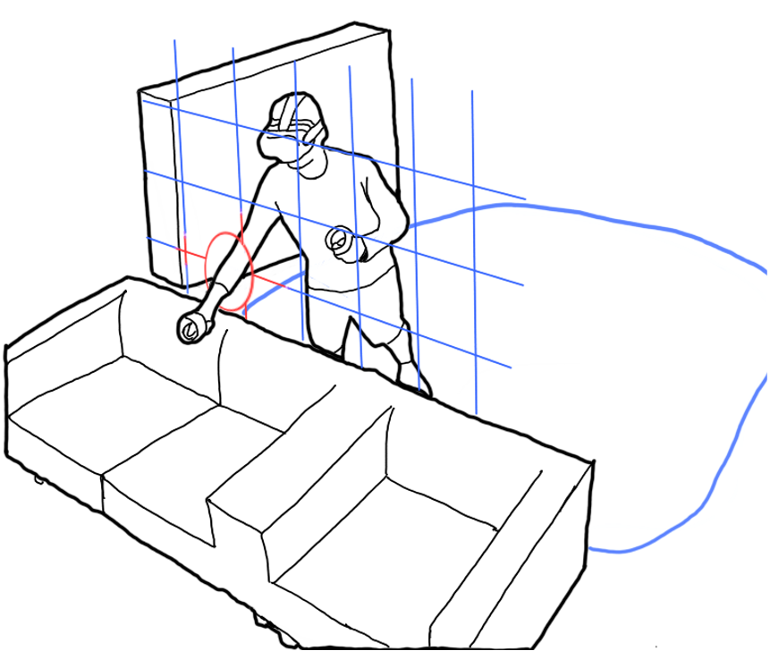
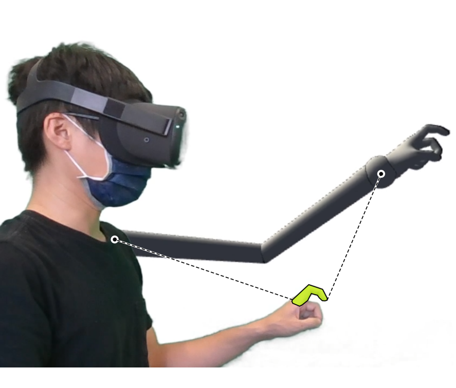
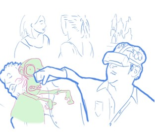
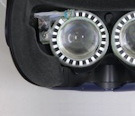
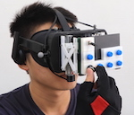
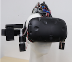
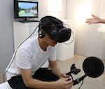

I am a Ph.D. student working on Human-Computer Interaction (HCI) and Virtual Reality (VR) research. I work at TU Darmstadt, Germany, and previously in the [DIVA Group](https://diva.telecom-paristech.fr/) at Telecom Paris, France.

My current research interest focuses on understanding people's cognitive and behavioral processes in the dual-environment paradigm from the VR perspective by conducting experiments. Additionally, I design interaction techniques to reduce collisions with the real-world environment and explore future safety mechanisms in VR. Please see the [research projects](projects.html) to know more.

In 2019, I completed my Master's degree at National Chiao Tung University, Taiwan. Our projects explored integrating input controls and haptic outputs with VR head-mounted displays.

{border-radius=10px, width=150px}
{border-radius=10px, width=150px}
{border-radius=10px, width=150px}
{border-radius=10px, width=150px}
{border-radius=10px, width=150px}

{border-radius=10px, width=150px}
{border-radius=10px, width=150px}
{border-radius=10px, width=150px}
{width=150px}

