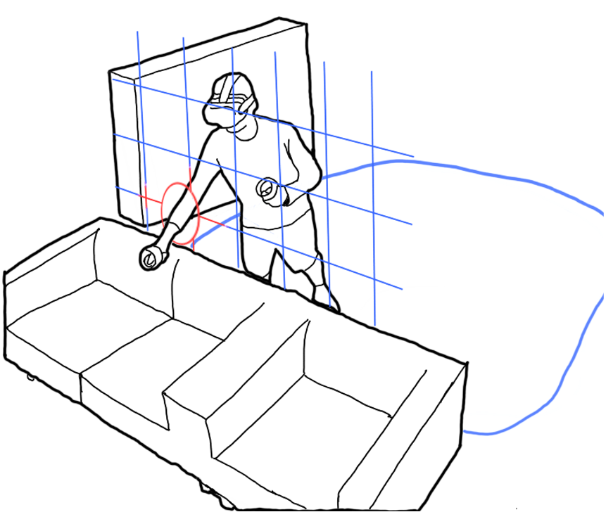
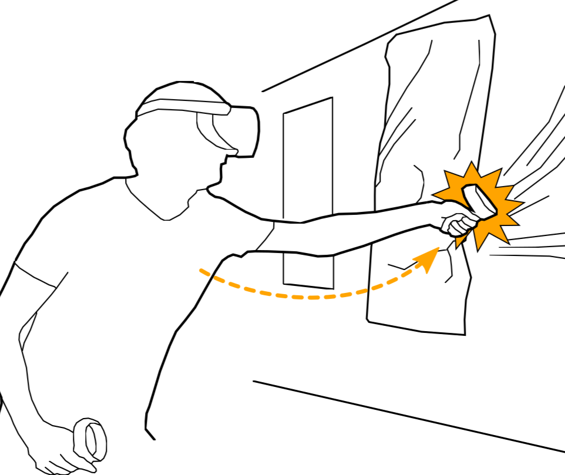
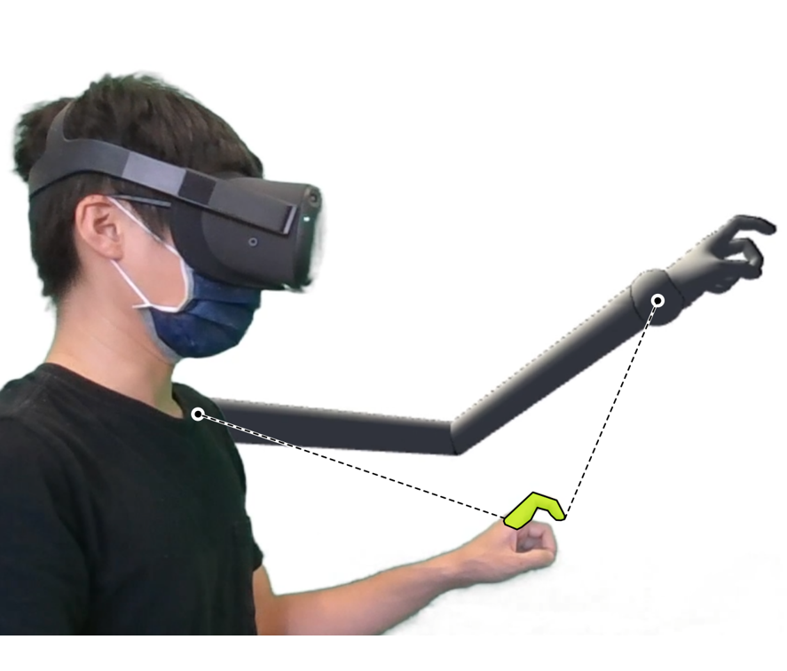
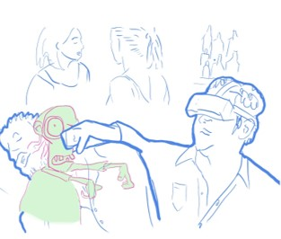
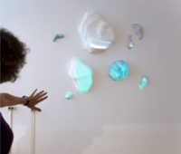
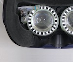
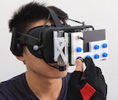
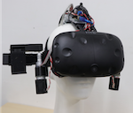
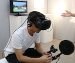

```{r load_packages, message=FALSE, warning=FALSE, include=FALSE} 
library(fontawesome)
```


Wen-Jie Tseng is a Postdoctoral Researcher at the Institute for Intelligent Systems and Robotics (ISIR), Sorbonne Université, France, with the [HCI Sorbonne](https://hci.isir.upmc.fr/) group. 
He received his Ph.D. in Computer Science from the Technical University of Darmstadt, Germany. 
His research interests focus on understanding bodily experiences in Virtual Reality (VR) through behavioral studies and interaction design. 
His work has been published in Human-Computer Interaction (HCI) venues such as ACM CHI, ACM UIST, and IEEE VR. 
Wen-Jie conducted his doctoral research at the [HCI Labs](https://www.informatik.tu-darmstadt.de/hci/hci_tuda/index.en.jsp), TU Darmstadt, and the [DIVA Group](https://diva.telecom-paristech.fr/), Télécom Paris, and completed a research stay at the [Human-Centred Computing Section](https://di.ku.dk/english/research/human-centred-computing/), University of Copenhagen. 
He holds an M.Sc. in Computer Science and a B.Sc. in Psychology, both earned in Taiwan.


<center>
{border-radius=10px, width=150px}
{border-radius=10px, width=150px}
{border-radius=10px, width=150px}
{border-radius=10px, width=150px}
{border-radius=10px, width=150px}


{border-radius=10px, width=150px}
{border-radius=10px, width=150px}
{border-radius=10px, width=150px}
{width=150px}
</center>

---

### Selected Publications

**1) Does the Peak-End Rule Apply to Judgments of Body Ownership in Virtual Reality?**

While body ownership is central to research in virtual reality (VR), it remains unclear how experiencing an avatar over time shapes a person's summary judgment of it. Such a judgment could be a simple average of the bodily experience, or it could follow the peak-end rule, which suggests that people's retrospective judgment correlates with the most intense and recent moments in their experiencing. We systematically manipulate body ownership over a three-minute avatar embodiment using visuomotor asynchrony. Asynchrony here serves to negatively influence body ownership.
We conducted one lab study ($N=28$) and two online studies (pilot: $N=97$ and formal: $N=128$)
to investigate the influence of visuomotor asynchrony given (1) order, meaning early or late, (2) duration and magnitude while controlling the order, and (3) the interaction between order and magnitude.
Our results indicate a significant order effect---later visuomotor asynchrony decreased the rating of body-ownership judgments more---but no convergent evidence on magnitude. We discuss how body-ownership judgments may be formed sensorily or affectively.

[`r fa("book")` IJHCS '25](https://www.sciencedirect.com/science/article/pii/S1071581925002198)
[`r fa("database")` OSF Repository](https://osf.io/8b4aw/overview)

**2) The Darkside of Perceptual Manipulations in Virtual Reality**

“Virtual-Physical Perceptual Manipulations” (VPPMs) such as redirected walking and haptics expand the user’s capacity to interact with Virtual Reality (VR) beyond what would ordinarily physically be possible. VPPMs leverage knowledge of the limits of human perception to effect changes in the user’s physical movements, becoming able to (perceptibly and imperceptibly) nudge their physical actions to enhance interactivity in VR. We explore the risks posed by the malicious use of VPPMs. First, we define, conceptualize and demonstrate the existence of VPPMs. Next, using speculative design workshops, we explore and characterize the threats/risks posed, proposing mitigations and preventative recommendations against the malicious use of VPPMs. Finally, we implement two sample applications to demonstrate how existing VPPMs could be trivially subverted to create the potential for physical harm. This paper aims to raise awareness that the current way we apply and publish VPPMs can lead to malicious exploits of our perceptual vulnerabilities.

[`r fa("book")` CHI '22](https://dl.acm.org/doi/abs/10.1145/3491102.3517728)
[`r fa("youtube")` Video](https://www.youtube.com/watch?v=uJRCchb_kAI)
[`r fa("newspaper")` Le Monde](https://www.lemonde.fr/sciences/article/2022/10/18/la-realite-virtuelle-face-au-risque-de-detournement-malveillant-de-ses-outils_6146356_1650684.html)


**3) FingerMapper: Mapping Finger Motions onto Virtual Arms to Enable Safe Virtual Reality Interaction in Confined Spaces**

Whole-body movements enhance the presence and enjoyment of Virtual Reality (VR) experiences. However, using large gestures is often uncomfortable and impossible in confined spaces (e.g., public transport). We introduce FingerMapper, mapping small-scale finger motions onto virtual arms and hands to enable whole-body virtual movements in VR. In a first target selection study (n=13) comparing FingerMapper to hand tracking and ray-casting, we found that FingerMapper can significantly reduce physical motions and fatigue while having a similar degree of precision. In a consecutive study (n=13), we compared FingerMapper to hand tracking inside a confined space (the front passenger seat of a car). The results showed participants had significantly higher perceived safety and fewer collisions with FingerMapper while preserving a similar degree of presence and enjoyment as hand tracking. Finally, we present three example applications demonstrating how FingerMapper could be applied for locomotion and interaction for VR in confined spaces.

[`r fa("book")` CHI '23](https://dl.acm.org/doi/abs/10.1145/3544548.3580736)
[`r fa("youtube")` Video](https://www.youtube.com/watch?v=E4x1Aw_meiw)
[`r fa("newspaper")` New Scientist](https://www.newscientist.com/article/2361193-play-vr-games-on-a-bus-by-wiggling-your-fingers-as-if-they-were-arms/)